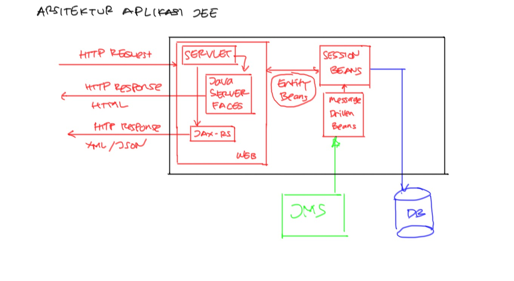

# Training Java EE 7 #

Materi:

* Instalasi
* Konfigurasi DataSource
* Entity Beans
* Java Persistence API
* Java Server Faces

## Komponen Java EE ##

Java EE 7 terdiri dari beberapa komponen utama:

* Session Beans : digunakan untuk implementasi proses bisnis
* Entity Beans : digunakan untuk mapping skema database ke java object
* Message Driven Beans : digunakan untuk menghandle message JMS
* Servlet : digunakan untuk menangani request HTTP

Java EE 7 Server menyediakan berbagai layanan/fitur, diantaranya:

* Java Naming & Directory Interface (JNDI) : untuk registrasi object dan service
* Java Transaction Service (JTS) : untuk mengurus database transaction
* Java Messaging Service (JMS) : mengurus messaging antar aplikasi dengan protokol JMS.

Arsitektur Aplikasi JEE

